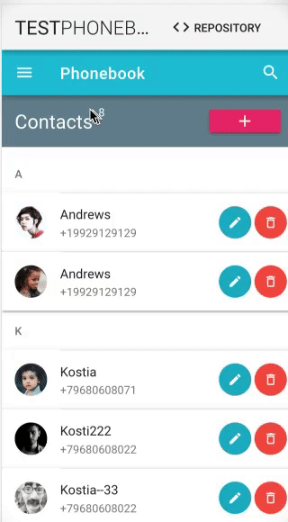

# phonebook-vue 


 

## Project setup
```
yarn install
```

### Compiles and hot-reloads for development
```
yarn run serve
```

### Compiles and minifies for production
```
yarn run build
```

### Run your tests
```
yarn run test
```

### Lints and fixes files
```
yarn run lint
```

### Customize configuration
See [Configuration Reference](https://cli.vuejs.org/config/).


# Here is the test:

Create a phonebook which allows to keep peoples names and phones. It has one page which allows to add, edit and remove entries via XHR. It also allows to download the phonebook as a text file (e.g. comma-separated) and also upload a new version.


When it uploads a file, it updates the phonebook, creating, updating and deleting records as appropriate. In short it has to sync (not just replace) the web-added data with the uploaded file.


You are allowed to use rich Javascript packages, but we encourage you to use newest, stable versions of whatever you will use to solve this problem.


